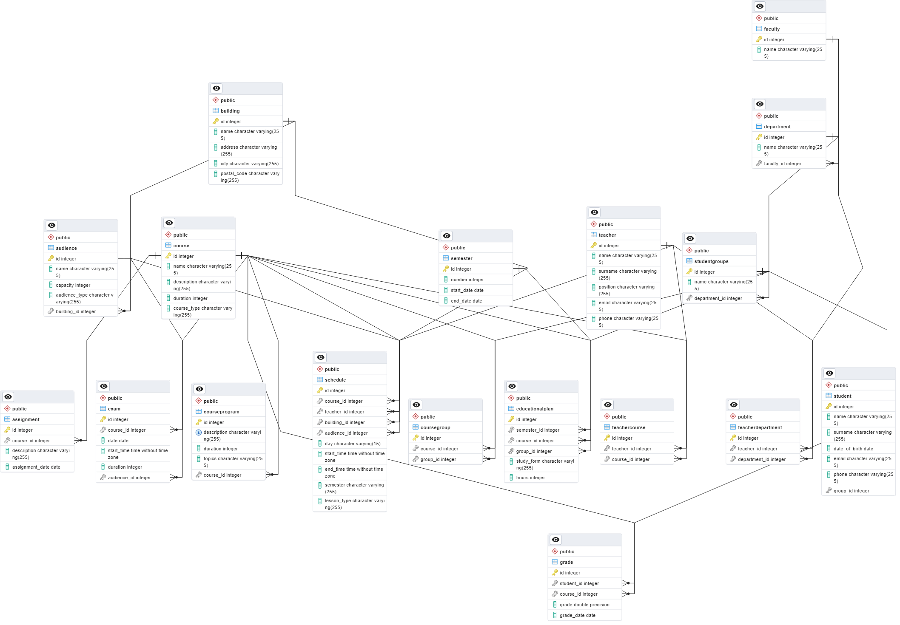

## ERD

## Установка и запуск
1. Убедитесь, что у вас установлен Docker и Docker Compose.
2. Склонируйте репозиторий проекта.
3. Создайте файл .env в корневой директории.

В качестве примера используйте файл .env_example

## Запуск проекта

```docker-compose up --build```

Api станет доступен по адресу http://localhost:8080

Для выполнения скриптов, указанных в ТЗ предусмотрен интерфейс по эндпоинту /execute_scripts в Swagger